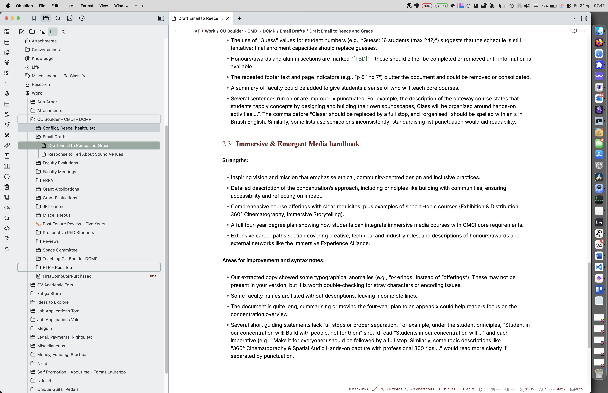
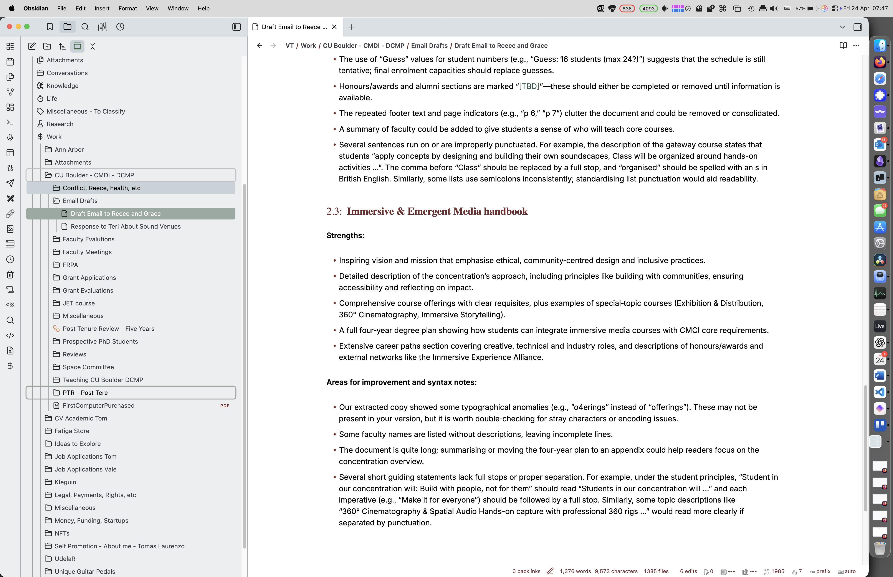

# audio_scripter 1.0.5

`audio_scripter` is a JUCE-based real-time scriptable audio effect plugin for **VST3**, **AU**, and **Standalone**.

It is designed for Ableton Live and other DAWs where users need fast, expressive experimentation beyond fixed-effect plugins.

## 1.0 highlights

- Script language for per-sample DSP with arithmetic, function calls, and persistent state.
- Lock-free script swap architecture (atomic compiled program snapshots).
- 8 DAW-automatable macro controls (`p1..p8`) available inside scripts.
- Script editor GUI with save/load, examples, compile diagnostics, and inline language help.
- Extended DSP primitives for creative effects: `fold`, `clip`, `crush`, `lpf1`, `slew`, `mix`, `wrap`, `tanh`, etc.
- Offline-friendly build option using a local JUCE checkout.

## Build

### Requirements

- CMake 3.22+
- C++20 compiler
- JUCE-compatible build toolchain for your platform/plugin formats

### Configure & build

Using local JUCE path (recommended for restricted environments):

```bash
cmake -S . -B build -DAUDIO_SCRIPTER_JUCE_PATH=/path/to/JUCE
cmake --build build --config Release
```

Using FetchContent (if GitHub access is available):

```bash
cmake -S . -B build
cmake --build build --config Release
```

## Script language quick guide

Each line is a statement:

```text
variable = expression;
```

### Built-in inputs

- `inL`, `inR`: input samples
- `sr`: sample rate
- `t`: playback time (seconds)
- `p1..p8`: macro controls (0..1, DAW-automatable)

### Outputs

- `outL`, `outR`

### Functions

- Math: `sin`, `cos`, `tan`, `abs`, `sqrt`, `exp`, `log`, `tanh`, `pow`, `min`, `max`
# audio_scripter 1.0.5

`audio_scripter` is a JUCE-based real-time scriptable audio effect plugin for **VST3**, **AU**, and **Standalone**.

It is designed for Ableton Live and other DAWs where users need fast, expressive experimentation beyond fixed-effect plugins.

## 1.0 highlights

- Script language for per-sample DSP with arithmetic, function calls, and persistent state.
- Lock-free script swap architecture (atomic compiled program snapshots).
- 8 DAW-automatable macro controls (`p1..p8`) available inside scripts.
- Script editor GUI with save/load, examples, compile diagnostics, and inline language help.
- Extended DSP primitives for creative effects: `fold`, `clip`, `crush`, `lpf1`, `slew`, `mix`, `wrap`, `tanh`, `pow`, `min`, `max`
- Offline-friendly build option using a local JUCE checkout.

## Build

### Requirements

- CMake 3.22+
- C++20 compiler
- JUCE-compatible build toolchain for your platform/plugin formats

### Configure & build

Using local JUCE path (recommended for restricted environments):

```bash
cmake -S . -B build -DAUDIO_SCRIPTER_JUCE_PATH=/path/to/JUCE
cmake --build build --config Release
```

Using FetchContent (if GitHub access is available):

```bash
cmake -S . -B build
cmake --build build --config Release
```

## Script language quick guide

Each line is a statement:

```text
variable = expression;
```

### Built-in inputs

- `inL`, `inR`: input samples
- `sr`: sample rate
- `t`: playback time (seconds)
- `p1..p8`: macro controls (0..1, DAW-automatable)

### Outputs

- `outL`, `outR`

### Functions

- Math: `sin`, `cos`, `tan`, `abs`, `sqrt`, `exp`, `log`, `tanh`, `pow`, `min`, `max`
- Utility: `clamp`, `clip`, `mix`, `wrap`
- Creative DSP: `fold`, `crush`, `smoothstep(edge0, edge1, x)`, `noise(seed)`, `gt(a, b)`, `lt(a, b)`, `ge(a, b)`, `le(a, b)`, `select(cond, a, b)`, `pulse(freqHz, duty)`, `env(x, attack, release [, id])`, `lpf1(x, coeff [, id])`, `slew(target, speed [, id])`

### State model

- Variables prefixed with `state_` persist sample-to-sample.
- `lpf1` and `slew` optional `id` isolates internal state lanes.

## Examples

Scripts in `examples/` and GUI dropdown include:

- transparent soft clip
- cross-feedback distortion
- time-ramp ring modulation
- low-pass morph
- wavefold shimmer
- stereo bit-crush drift
- noisy transient gate
- rhythmic pulse gate
- envelope duck tremor


## Local checks

## Screenshots

Below are placeholder screenshots. Replace these with real captures from the editor and plugin UI.






```bash
python3 tools/validate_scripts.py
```

Parser test target (after CMake configure):

```bash
cmake --build build --target audio_scripter_parser_tests
ctest --test-dir build --output-on-failure
```

## Release docs

- Language spec: `docs/LANGUAGE_SPEC.md`
- Changelog: `docs/CHANGELOG.md`
- Roadmap after 1.0: `docs/ROADMAP.md`
